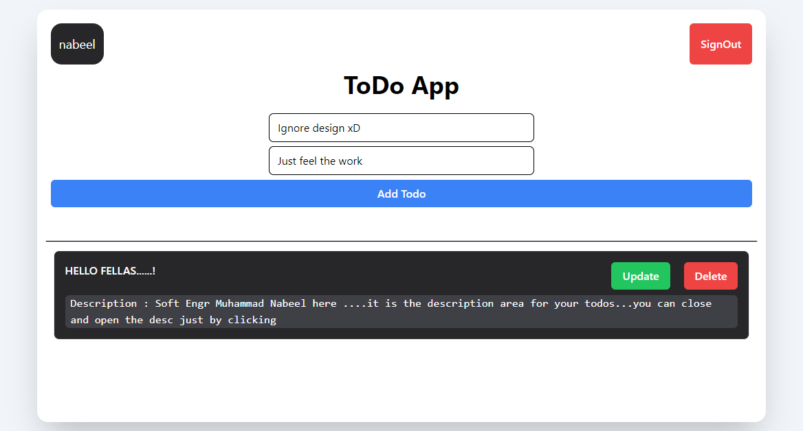
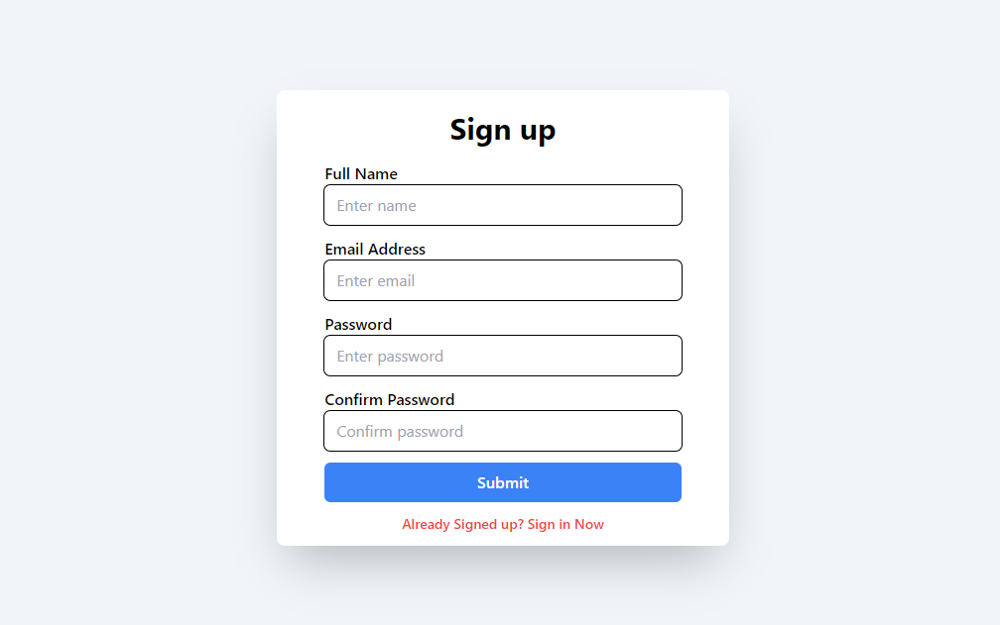
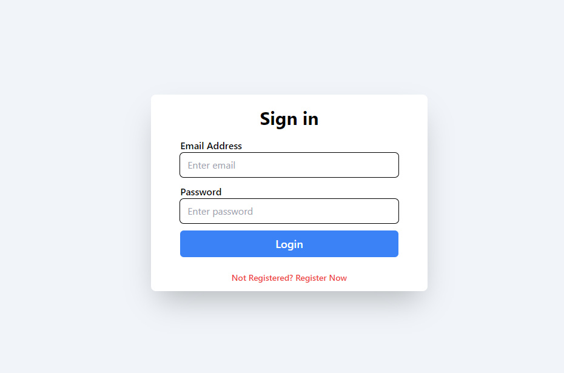

# TodoAuthApp Singup/Singin && CRUD



## Overview

TodoAuthApp is a full-stack todo application with authentication functionality, allowing users to securely manage their todos. Built using React, Firebase Realtime Database, Vite, and Tailwind CSS, this project emphasizes smooth functionality and optimization.

## Key Features

- **User Authentication**: Implement secure signup and signin functionalities.
- **Todo Management**: Users can create, update, and delete their todos.
- **Real-time Synchronization**: Todos are synchronized instantly across devices with Firebase Realtime Database.
- **Optimized Performance**: The project prioritizes efficiency and smooth functionality.
- **Error-free Code**: Thorough debugging ensures reliability and stability.

## Screenshots

### Signup Page



### Signin Page



## Installation

1. Clone the repository:

   ```bash
   git clone https://github.com/yourusername/TodoAuthApp.git
   ```

2. Navigate to the project directory:

   ```bash
   cd TodoAuthApp
   ```

3. Install dependencies:

   ```bash
   npm install
   ```

## Usage

1. Start the development server:

   ```bash
   npm run dev
   ```

2. Access the application in your browser at `http://localhost:5173`.

## Contact Information

**Muhammad Nabeel Khan**
- Email: [se.muhammadnabeel@gmail.com](mailto:se.muhammadnabeel@gmail.com)
- GitHub: [SoftEngrMuhammadNabeel](https://[github.com/yourusername](https://github.com/softengrmuhammadnabeel/))
